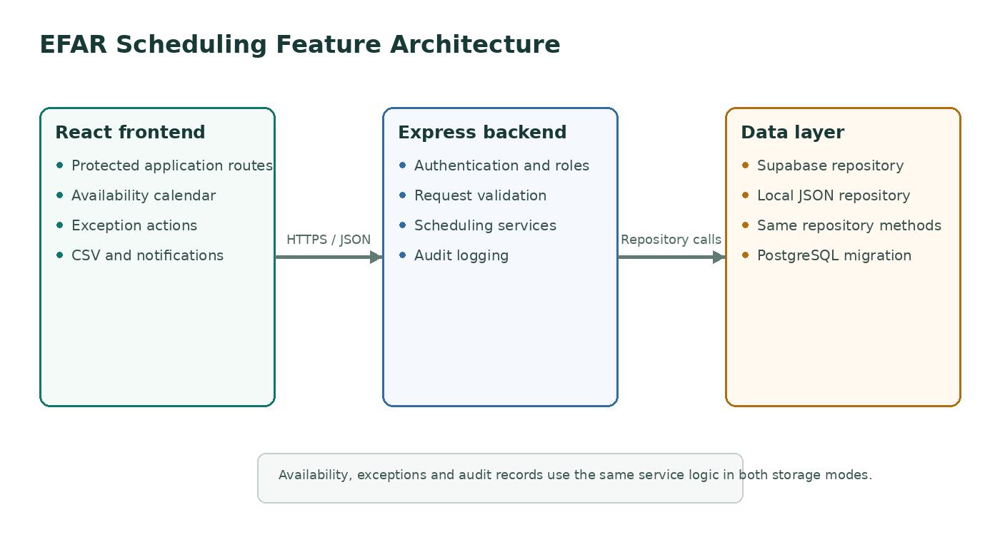

# System Architecture

The browser runs a React application with protected routes for availability and exception management. Requests are sent to an Express API using a bearer token.

The Express layer handles authentication, role checks, request validation and business rules. Route files call service classes, and services use a repository interface for data access.

Two repository implementations are included:

- Supabase repository for the shared PostgreSQL database
- Local JSON repository for standalone execution

The same service and route code is used with either repository. This keeps the feature separate from the final group schema while limiting the integration changes to the repository layer.

